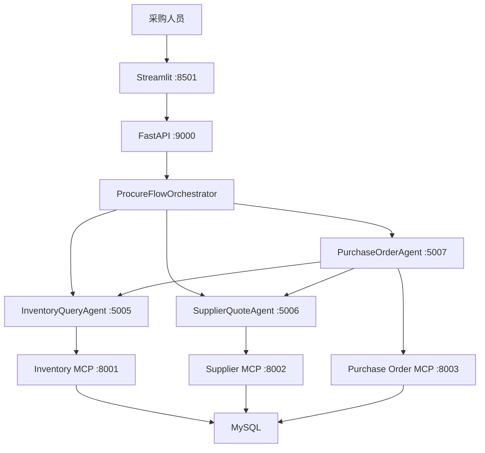

# ProcureFlow 企业采购与供应链多智能体协同平台

ProcureFlow 是一个基于 A2A 与 MCP 的企业采购协同系统。它协调库存查询、供应商询报价和采购订单三个专业 Agent，完成从库存核验、报价比较、供应商选择、人工确认到采购单落库的完整流程。

项目围绕制造企业物料采购链路设计，领域模型、MySQL 数据库、Agent 协作、MCP 工具、FastAPI 接口、Streamlit 前端和单元测试共同组成一套可运行的作品集 Demo。

面试讲解、采购术语和高频追问见：
[ProcureFlow 面试准备](docs/INTERVIEW_PREP.md)。

## 核心能力

- 库存查询：按物料编码、名称或仓库查询在库量、占用量、可用量和安全库存状态；
- 供应商询报价：校验最小起订量与报价有效期，比较单价、交期、评级和准时交付率；
- Agent 协作：采购订单 Agent 下单前，并行调用库存 Agent 与供应商 Agent 完成二次核验；
- 人工确认：采购单写入前必须补齐关键字段并明确确认；
- 结构化 MCP：查询工具只接受业务参数，不向客户端暴露任意写 SQL；
- 可靠写入：参数化 SQL、数据库事务、幂等键、有效报价校验和审计日志；
- 订单状态：支持待审批、已审批、已发送、部分收货、已收货和已取消等状态；
- LLM 可选：未配置模型 Key 时使用规则路由，配置 Qwen 后启用实体抽取与结果总结。

## 架构



其中 A2A 负责 Agent 之间的任务派发、状态和结果传递，MCP 负责把库存、报价和采购单能力封装为标准工具。最终一致性由数据库事务、唯一幂等键和审计日志保证，不依赖大模型自行判断。

## 目录

```text
ProcureFlow_agent/
├── ProcureFlow/
│   ├── app.py                         # Streamlit 对话前端
│   ├── api.py                         # FastAPI 对话接口与健康检查
│   ├── orchestrator.py                # 意图路由、A2A 调度与结果汇总
│   ├── intent_router.py               # Qwen 路由与规则降级
│   ├── services.py                    # 库存、报价和采购单领域服务
│   ├── db.py                          # MySQL 查询与采购单事务
│   ├── security.py                    # 只读 SQL 白名单校验
│   ├── config.py                      # 环境变量配置
│   ├── prompts.py                     # Agent 与总结提示词
│   ├── run_all.py                     # 启动 MCP、A2A、同步任务和 API
│   ├── a2a_server/
│   │   ├── inventory_agent.py
│   │   ├── supplier_agent.py
│   │   └── purchase_order_agent.py
│   ├── mcp_server/
│   │   ├── inventory_server.py
│   │   ├── supplier_server.py
│   │   └── purchase_order_server.py
│   └── jobs/sync_supplier_quotes.py   # 供应商报价定时同步
├── data/supplier_quotes.json          # 模拟 SRM 报价数据源
├── sql/                               # 建表与种子数据
├── scripts/                           # PowerShell 启动脚本
├── tests/                             # 单元测试
├── docs/INTERVIEW_PREP.md             # 项目讲解与面试准备
├── docker-compose.yml
└── requirements.txt
```

## 环境

本机已有课程环境时，可直接使用：

```powershell
conda activate smartVoyage
python --version
```

也可以创建独立虚拟环境：

```powershell
python -m venv .venv
.venv\Scripts\Activate.ps1
pip install -r requirements.txt
```

复制配置：

```powershell
Copy-Item .env.example .env
```

填写 `.env` 中的 MySQL 配置和 `OPENAI_API_KEY`。项目通过 OpenAI 兼容接口调用 Qwen；Key 留空时使用规则路由完成基础意图识别。

## 初始化数据库

推荐使用 Docker Compose。首次启动 MySQL 时会自动执行 `sql/01_schema.sql` 和 `sql/02_seed_data.sql`，只创建 ProcureFlow 数据库、业务表和演示数据：

```powershell
docker compose up -d mysql
docker compose ps
```

默认数据库为 `procureflow`。

演示物料：

| 物料编码 | 物料名称 | 仓库 | 在库量 | 占用量 | 可用量 | 安全库存 |
|---|---|---|---:|---:|---:|---:|
| `MAT-1001` | 工业温度传感器 | 上海一号仓 | 260 | 40 | 220 | 80 |
| `MAT-1002` | PLC 控制模块 | 苏州备件仓 | 65 | 12 | 53 | 30 |
| `MAT-2001` | 304 不锈钢板 | 无锡原料仓 | 140 | 35 | 105 | 120 |

系统还会写入 3 家演示供应商及 `MAT-1001` 的阶梯报价，用于比较价格、交期、评级和准时交付率。

## 启动系统

在项目根目录执行：

```powershell
python -m ProcureFlow.run_all
```

该命令会启动 3 个 MCP Server、3 个 A2A Agent Server、供应商报价同步任务和 FastAPI 服务。

另开一个终端启动前端：

```powershell
python -m streamlit run ProcureFlow/app.py --server.port 8501
```

访问：

```text
http://127.0.0.1:8501
```

也可以分别在两个终端使用脚本：

```powershell
.\scripts\start_all.ps1
.\scripts\start_web.ps1
```

## 手动启动

先启动 MCP：

```powershell
python -m ProcureFlow.mcp_server.inventory_server
python -m ProcureFlow.mcp_server.supplier_server
python -m ProcureFlow.mcp_server.purchase_order_server
```

再启动 A2A Agent：

```powershell
python -m ProcureFlow.a2a_server.inventory_agent
python -m ProcureFlow.a2a_server.supplier_agent
python -m ProcureFlow.a2a_server.purchase_order_agent
```

最后启动 API 与前端：

```powershell
python -m uvicorn ProcureFlow.api:app --host 127.0.0.1 --port 9000
python -m streamlit run ProcureFlow/app.py --server.port 8501
```

## 演示流程

可以依次输入：

```text
查询 MAT-1001 的可用库存
比较采购 100 件 MAT-1001 的供应商报价
查询库存并比较 MAT-1001 采购 100 件时的报价和交期
为 MAT-1001 创建 100 件采购单
查询 PO2026092000123 的订单状态
```

完整下单需要申请人、供应商 ID、物料编码、数量、单价和期望交付日期。用户未确认时，订单 Agent 只返回预览与缺失字段，不会写入数据库。

## API

健康检查：

```powershell
Invoke-RestMethod http://127.0.0.1:9000/health
```

对话接口：

```powershell
$body = @{
    query = "查询 MAT-1001 的库存，并比较采购 100 件的供应商报价"
    confirmed = $false
    idempotency_key = "demo-001"
} | ConvertTo-Json

Invoke-RestMethod `
    -Uri http://127.0.0.1:9000/api/chat `
    -Method Post `
    -ContentType "application/json" `
    -Body $body
```

## 测试

```powershell
python -m compileall ProcureFlow tests
python -m unittest discover -s tests -v
```

当前包含 10 项单元测试，覆盖组合意图识别、订单字段校验、人工确认和只读 SQL 防护。端到端测试前需要先启动 MySQL、MCP 与 A2A 服务。

## 安全边界

- 数据库凭据和模型 Key 通过 `.env` 管理，真实密钥不进入 Git；
- 库存与报价 MCP 使用结构化业务参数，不暴露任意写 SQL；
- 如扩展 Text-to-SQL，只允许单条 `SELECT`、表白名单和最大返回行数；
- 采购单写入使用参数化 SQL，不执行模型生成的 `INSERT` 或 `UPDATE`；
- 写入前校验物料、供应商状态、报价有效期、MOQ、阶梯价和交付日期；
- 用户未确认时不能创建采购单；
- `idempotency_key` 唯一约束防止重复下单；
- 采购单与明细在同一事务内写入，失败时整体回滚；
- 关键写操作记录审计日志，便于追踪申请人和业务动作。

## 采购业务边界

- 可用量等于在库量减占用量；
- 供应商选择不只看最低价，还要比较 MOQ、交期、评级和准时交付率；
- 创建采购单代表未来入库，不会扣减当前库存；完成收货过账后才增加在库量；
- 真实企业还需要审批权限、收货、质检、发票和三单匹配，本项目暂未覆盖这些模块。

## 当前范围

本项目是可运行的课程实战与个人作品集 Demo，不接入真实 ERP、SRM、财务付款和物流平台。供应商报价通过 JSON 文件模拟外部系统同步。后续可以扩展：

- 采购申请与多级审批流；
- 在途库存、到货、质检和退货；
- 供应商质量合格率与风险评分；
- ERP/SRM API 与消息队列；
- Redis 会话和分布式任务状态；
- OpenTelemetry 或 LangSmith 调用链；
- A2A Agent Card 动态发现与服务治理。

## 许可证

当前仓库尚未添加开源许可证。如需允许他人复制、修改和分发，可在确认授权范围后补充 MIT、Apache-2.0 或其他许可证。
